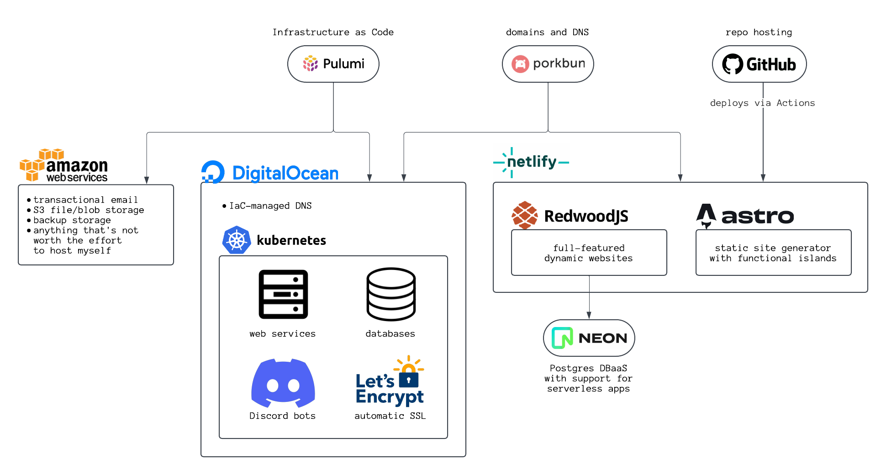

I just migrated my blog from [Ghost](https://ghost.org/) to
[Astro](https://astro.build/). I realized I haven't posted something new in two
years, so I thought I'd take this opportunity to share how I work on software in
my personal time.

# Preamble

Until recently, I was hosting my blog using self-hosted Ghost on my personal
Kubernetes cluster. I like Ghost a lot, but the reasons I picked it originally
were: it has a web editor, and it's not Wordpress. I originally paid for hosted
Ghost Pro just to get started, but eventually I set up a self-hosted MySQL
database via the [moco operator](https://github.com/cybozu-go/moco), which let
me save some money on hosting.

Moco is high-quality software, it works reliably (even backup and restore), and
the team writes high-quality documentation. But it's pre-1.0 and I found myself
going through difficult upgrade processes more than once, so I've been looking
for an excuse to move back to a static site generator.

These days, most of my personal web work is done in Astro, so that's where I
migrated my blog content. Welcome to the new site!

# My Principles

These days, I feel like I already spend too much time maintaining and thinking
about my home servers. I want to reclaim some of my time by simplifying the way
I develop and ship software, and these principles help me get there.

- **Automation saves time:** If you plug the repo straight into CI, you can push
  to deploy. If you don't automate this process, your deploy script will soon
  break, and then you'll have to fix that instead of deploying your feature.
- **Shorten the minimum loop:** I only program for fun when a project is already
  loaded into my brain. If I put down a high-friction project for a while, I
  might never pick it back up. Choosing simpler frameworks means the minimum
  loop – the amount of time it takes to pick up a project, write a minimal
  feature, and deploy to production – stays shorter.
- **Stay frugal:** A project that consumes no resources produces no stress.
  Modern platform hosts have generous free tiers within which you can easily
  remain if you make the right technical decisions.
- **Use patterns:** Prefer the same sets of tools for the same tasks. Pick the
  thing that works, not the different thing that's shiny. If you solve a
  problem, solve it categorically. If you see something three or more times,
  it's time to make it a template.

# My Tech Stack

I have some redundancy in my tech stack, but not much. Let's discuss:

## Infrastructure as Code: Pulumi

I write a lot of Terraform in my day job and I don't love it. The outcomes from
managing infrastructure using code are excellent, but defining complicated
configurations in HCL is a pain. [Pulumi](https://www.pulumi.com/) embraces the
typed programming language and allows you to define your software stack in
TypeScript. As a developer, this means you get high-quality linting in your
systems _before_ your apply operation fails. It's also a natural fit for
_composing_ your stack together: it is trivial to extract an existing app's
hosting config (i.e. compute + ingress + DNS) into a builder function which acts
as a _template_ you can use to host all your other apps in the same spot.

## Domains and DNS: Porkbun

After some poor experiences in the past with domain registrars that don't
respect their customers, I've moved all my domains to
[Porkbun](https://porkbun.com/) where I'm very happy. Their prices are
competitive, their DNS service is reliable, and they are my favorite no-nonsense
place to buy a .com.

## Code hosting and CI: GitHub

GitHub is the unrivaled home of open source, and it's where
[my software](https://github.com/mplewis) lives. GitHub Actions is perhaps not
the cheapest CI/CD solution, but it's well-integrated and reasonably painless
for my automated testing and deployment needs. I stay in the free tier.

## Static and serverless hosting: Netlify

[Netlify](https://www.netlify.com/) has long been a straightforward way to turn
a Git repo into a hosted website, including any optional build step. But their
offerings have advanced dramatically since they first launched, and now they are
a formidable host for serverless apps. They repackage the reliable AWS Lambda at
very reasonable per-request prices with a generous free tier.

Serverless platforms manage all of your compute infrastructure for you, charging
you per request and per execution second rather than charging you to rent a
server by the month. These days, if I can build my app into a serverless
paradigm, I do – they are extremely cheap to free on the low end and nearly
zero-maintenance. RedwoodJS and Astro are two frameworks that help me accomplish
this, and they both deploy natively to Netlify.

## Dynamic apps: RedwoodJS

Ruby on Rails has long been a powerful solution for booting up your new
startup's codebase, but what if you're trying to avoid running persistent
servers that need to be always-on to handle requests? And what if you're looking
to take advantage of more modern paradigms for integrating your frontend and
backend code?

[RedwoodJS](https://redwoodjs.com/) is a framework that tackles the approximate
scope of vanilla Rails or Django: it has relational database models and
migrations, it renders HTML, and it ships JS to your browser. It also goes
beyond: the frontend and backend aspects are tightly integrated via
[Cells](https://docs.redwoodjs.com/docs/tutorial/chapter2/cells/), React
components which handle the data lifecycle for you. And with
[RSC](https://redwoodjs.com/blog/rsc-now-in-redwoodjs) landing in the framework
soon, it will be even easier for you to simply ask for the data you need and
have it magically arrive in your UI.

I am excited about the future of Redwood. The leadership is focused on building
features that help me be more productive. They have prioritized non-breaking
upgrade paths on their journey from v1 to v8, something that has caused me no
end of grief with Rails. And they are transparent about their roadmap and
development priorities, which gives me confidence that the app I build today can
be even better tomorrow.

## Static sites: Astro

Not everything needs a SQL database. What if your project is, say,
[a blog](http://kesdev.com)? What if it's a
[community hub](https://kqmunity.com/)? And what if you want to use tools like
React to build a component hierarchy without requiring your users to run some JS
just to see your text on a page?

[Astro](https://astro.build/) is a framework for building high-performance
static sites that also supports dynamic behavior. By default, anything you build
in Astro is rendered at _compile time_ into static HTML – no JS is sent to the
browser! But for interactive bits, you can add
[islands](https://docs.astro.build/en/concepts/islands/) of interactivity, and
you can even slot server-rendered content directly into an otherwise-static
page.

With support for React, MDX, Tailwind, and RSS via first-party addons, the Astro
team has shown their priority is to give you the tools you need to build the
site you want. Astro is the best fit for most of my content today, and I am
excited to continue using it as it grows.

## Serverless-friendly DB: Neon

Postgres databases are expensive, especially if you're not using the database
24/7. My small apps are well-served by [Neon](https://neon.tech/), a "serverless
Postgres" platform. What's a serverless database, exactly? This means that Neon
is happy to serve individual requests from my Netlify function requests, and
they manage the complexities of shared DB hosting for me, including the
pgbouncer instance.

When a new request comes in, they quickly boot my database up and serve the
request, and when it's idle for 10 minutes, they suspend it and stop charging
me. This makes Neon extremely cost-efficient for my side projects which may be
only occasionally used by a few people, but should still be highly avilable.
It's a match made in heaven for dynamic apps hosted on Netlify.

## Cloud services: AWS

There are some categories of services I am not interested in hosting right now.
I don't want to spend my time trudging toward a reliable, redundant setup for
blob storage, hosted databases with recovery, or reliable email delivery. When I
need these things, I am happy to pay AWS, the cloud provider that has
historically been excellent for long-term support. I can be confident that the
services I'm using today won't be taken offline in six months.

## General-purpose hosting: Kubernetes

[Kubernetes](https://kubernetes.io/) is for everyone, including you! If your
goal is to build a production-quality service, featuring rolling deployments,
redundant compute hosting, and several nines of uptime, Kubernetes solves these
problems in a way that's accessible if not immediately friendly.

## Managed Kubernetes and DNS: DigitalOcean

DigitalOcean's
[managed Kubernetes](https://www.digitalocean.com/products/kubernetes) offering
is reliable and extremely affordable. You pay the sticker price for data plane
Droplets in your cluster and the managed control plane is free.

I use Pulumi to provision my k8s cluster, connect it to DO public load
balancers, set up DNS entries programmatically via DO networking, and request
SSL certificates for my apps using
[Cert Manager](https://cert-manager.io/docs/). Now, putting a Docker image on
the public internet _is_ my happy path.
